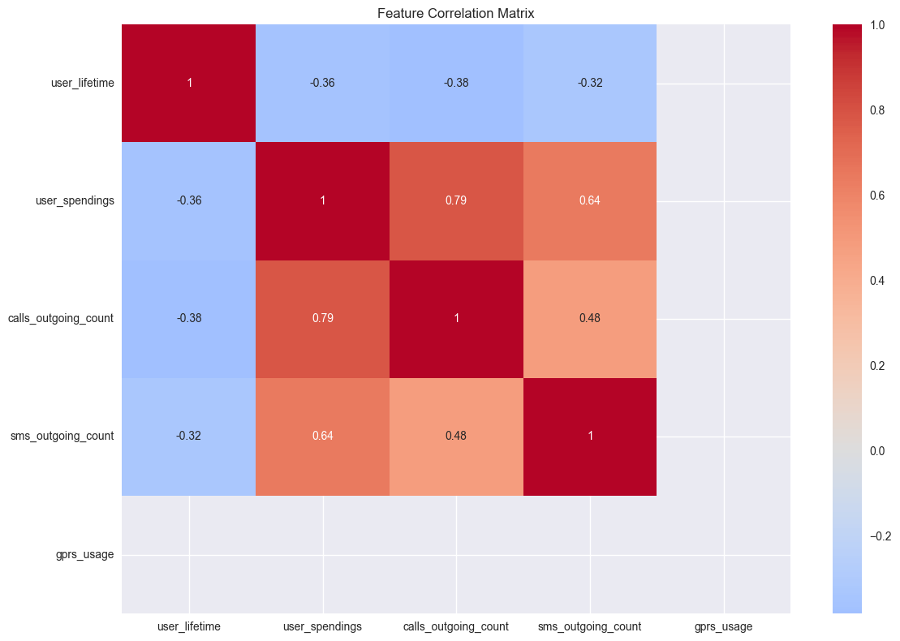

# Customer Churn Analysis Project

## Overview
This project implements a machine learning solution for predicting customer churn in a telecommunications company. Two models (Random Forest and XGBoost) were developed and deployed as a web application for easy testing and comparison.

## Table of Contents
- [Project Structure](#project-structure)
- [Data Analysis](#data-analysis)
- [Feature Engineering](#feature-engineering)
- [Model Development](#model-development)
- [API Development](#api-development)
- [Installation & Usage](#installation--usage)
- [Results](#results)

## Project Structure
```
.
├── README.md
├── app.py
├── data
│   ├── processed
│   │   ├── churn_train_engineered.csv
│   │   └── churn_train_processed.csv
│   └── raw
│       └── churn_train.csv
├── images
│   ├── Homepage.png
│   ├── correlation.png
│   ├── feature_distributions.png
│   └── important_feature.png
├── models
│   └── saved_models
│       ├── random_forest.joblib
│       └── xgboost.joblib
├── notebooks
│   ├── 01_exploratory_analysis.ipynb
│   ├── 02_feature_engineering.ipynb
│   └── 03_model_development.ipynb
├── requirements.txt
├── setup.py
├── src
│   ├── data
│   │   ├── __pycache__
│   │   │   └── data_processor.cpython-310.pyc
│   │   └── data_processor.py
│   ├── features
│   │   ├── __pycache__
│   │   │   └── features_builder.cpython-310.pyc
│   │   └── features_builder.py
│   ├── models
│   │   ├── __pycache__
│   │   │   └── model_trainer.cpython-310.pyc
│   │   └── model_trainer.py
│   └── visualization
│       ├── __pycache__
│       │   └── visualizer.cpython-310.pyc
│       └── visualizer.py
└── templates
    └── index.html
```

## Data Analysis

### Feature Correlation Analysis


Key findings from correlation analysis:
- Strong positive correlation (0.79) between user_spendings and calls_outgoing_count
- Negative correlation between user_lifetime and other usage metrics
- Moderate correlation (0.64) between user_spendings and sms_outgoing_count

### Feature Distribution Analysis


Key observations:
- Clear distinction in user_lifetime distribution between churned and non-churned customers
- Higher spending patterns in non-churned customers
- Significant differences in call and SMS patterns between customer groups
- GPRS usage shows minimal variation between groups

## Feature Engineering

### Feature Importance


Most influential features:
1. user_spendings (0.42)
2. calls_outgoing_duration_max (0.12)
3. sms_incoming_count
4. user_no_outgoing_activity_in_days
5. calls_outgoing_count

### Engineered Features
- Activity ratios (active_days_ratio)
- Usage intensity metrics (calls_per_day, sms_per_day)
- Financial indicators (spending_per_day, reload_frequency)
- Service usage patterns (service_diversity)

## Model Development

### Random Forest Performance
```
Accuracy: 86%
ROC-AUC Score: 0.900
Precision (Class 1): 0.63
Recall (Class 1): 0.77
F1-Score (Class 1): 0.69
Cross-validation Score: 0.943 ± 0.015
```

### XGBoost Performance
```
Accuracy: 86%
ROC-AUC Score: 0.902
Precision (Class 1): 0.64
Recall (Class 1): 0.76
F1-Score (Class 1): 0.70
Cross-validation Score: 0.956 ± 0.022
```

## API Development
The project includes a Flask web application that allows users to:
- Choose between Random Forest and XGBoost models
- Input customer metrics
- Receive real-time churn predictions
- Compare model performances

## Installation & Usage

1. Clone the repository:
```bash
git clone https://github.com/enesfarukkeskin/customer-churn-analysis.git
cd churn-analysis
```

2. Create and activate virtual environment:
```bash
python -m venv venv
source venv/bin/activate  # Windows: venv\Scripts\activate
```

3. Install dependencies:
```bash
pip install -r requirements.txt
```

4. Run the application:
```bash
python app.py
```

5. Access the web interface at `http://localhost:5000`

### Using the Web Interface

1. **Home Page** (`/`):
   - Select Model
   - Fill in the blanks on the page that opens.
   - Click "Predict" to get the prediction


## Results and Conclusions

1. Model Performance:
   - Both models achieve similar accuracy (86%)
   - XGBoost shows slightly better ROC-AUC (0.902 vs 0.900)
   - XGBoost has better cross-validation scores (0.956 vs 0.943)

2. Key Findings:
   - Customer spending is the most important predictor
   - Call duration and SMS patterns are significant indicators
   - Inactive periods strongly correlate with churn

3. Recommendations:
   - Monitor user spending patterns
   - Track communication activity levels
   - Focus on customer engagement during inactive periods

## Future Improvements (I DON'T HAVE TO TİME DO THESE)
1. Feature Engineering:
   - Develop more complex interaction features
   - Include temporal patterns analysis

2. Model Enhancement:
   - Implement ensemble methods
   - Explore deep learning approaches

3. API Development:
   - Add batch prediction functionality
   - Implement model retraining pipeline

## Contact

Enes Faruk Keskin - [enesfarukkeskin@gmail.com]

